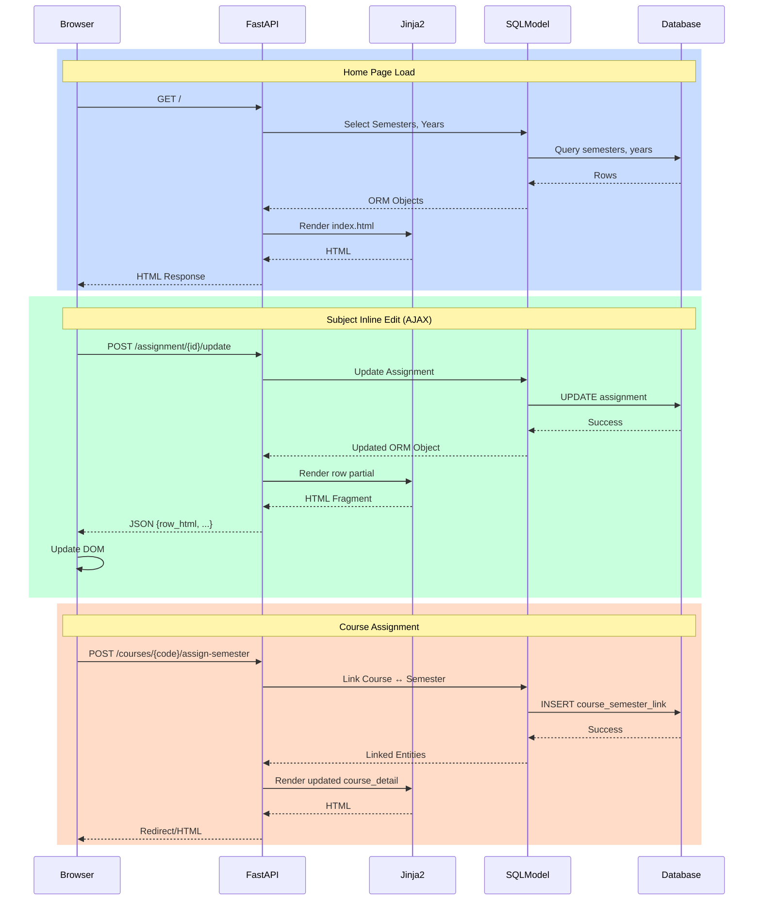

# University Marks Manager

FastAPI + SQLModel + Jinja2 web application for managing university subjects, assignments, and exam mark projections across semesters and academic years.

## ✅ Key Features

**Academic Structure**

- Multi-year + semester organisation
- Subject CRUD
- Assignment CRUD with inline (AJAX) editing

**Grading & Calculation**

- Numeric and S / U grade types
- Independent `weighted_mark` and `mark_weight` entry (unweighted auto-derived)
- Target total mark → required exam mark solver (with progressive scaling mode)
- Real-time recomputation on add/update

**UX**

- Clean Tailwind/DaisyUI interface
- Inline row editing (no full page refresh)
- Dark / light theme toggle (persisted in localStorage)

**Persistence**

- SQLite (via SQLModel / SQLAlchemy engine) in `data/marks.db`
- Exam scaling settings preserved per subject

## 📂 Current Stack

| Layer           | Tech                           |
| --------------- | ------------------------------ |
| Web framework   | FastAPI                        |
| Templates       | Jinja2                         |
| ORM             | SQLModel / SQLAlchemy          |
| Styling         | Tailwind CSS (+ DaisyUI)       |
| JS Enhancements | Vanilla + small inline helpers |

## 🚀 Quick Start

You can run locally with the built-in SQLite database, or via Docker Compose with Postgres and Nginx.

### Option A — Local dev (SQLite fallback)

```powershell
python -m venv .venv
.venv\Scripts\activate
pip install -r requirements.txt
uvicorn src.app.main:app --reload
```

Visit: http://127.0.0.1:8000

Notes:

- SQLite DB file lives at `data/marks.db` and is auto-created on startup.
- On Windows, `StartMarkManager.bat` is a convenience wrapper for uvicorn. It uses a Conda
  environment named via the `CONDA_ENV` variable, falling back to `umm` if unset.

#### Windows (Conda) quickstart

Create and use a dedicated Conda environment (PowerShell):

```powershell
conda create -n umm python=3.11 -y
conda activate umm
pip install -r requirements.txt

# Optional: set for this session; StartMarkManager.bat will default to 'umm' if not set
$env:CONDA_ENV = "umm"

# Run the app via the helper script
./StartMarkManager.bat
```

### Option B — Docker Compose (Postgres + Nginx)

```powershell
docker compose up -d
```

Visit: http://localhost:18000

## 📅 Year filter and canonical URLs

Home supports a year filter with clean, pretty URLs:

- `GET /year/{YYYY}` — Home scoped to a single year (e.g., `/year/2025`)
- `GET /all` — Home across all years

Legacy query params are redirected to the canonical paths for consistency:

- `/?year=2025` → 303 redirect to `/year/2025`
- `/?year=` or `/?year=all` → 303 redirect to `/all`

The Home link preserves your current selection and points to `/year/{YYYY}` or `/all` accordingly. The Courses tab remains a separate section.

Semester pages also have a canonical pretty URL:

- `GET /year/{YYYY}/semester/{SEMESTER}` — Semester detail for a year

Legacy `GET /semester/{SEMESTER}?year={YYYY}` will 303 redirect to the canonical path above.

Notes on Docker deployment:

- This stack is now image-driven (no live bind-mount of app code into the web container) to avoid drift between local files and what Nginx serves.
- After code changes, rebuild the image to pick up template/route updates:

```powershell
docker compose build web; docker compose up -d
```

- Nginx is configured with conservative timeouts and `no-store` headers for dynamic HTML. If you still see stale pages, do a hard refresh in your browser (Ctrl+F5 on Windows).
- The `web` service exposes a healthcheck (`GET /healthz`) and Nginx waits for it to be healthy before proxying.

- Stop containers: `docker compose down`
- View logs (follow): `docker compose logs -f`
- Exec in web container: `docker compose exec web bash`

## 🧪 Tailwind CSS (Local Compilation)

If you want to remove CDN usage:

```powershell
npm install
npm run watch
```

Or build once for production:

```powershell
npm run build:css
```

Inputs/outputs:

- Source: `src/static/css/input.css`
- Output: `src/static/css/tailwind.css`

Note: A Git pre-commit hook (Husky) runs `npm run build:css` and will stage an updated `src/static/css/tailwind.css` if it changes, then ask you to re-run your commit.

See `docs/tailwind-cli-install.md` for full details.

## 🗂 Project Layout (Relevant Parts)

```
src/
   app/main.py            # FastAPI app factory & router include
   presentation/web/
      views.py             # Aggregated router registration
      assignment_views.py  # Assignment endpoints (CRUD + AJAX)
      subject_views.py     # Subject detail & create
      semester_views.py    # Semester CRUD/listing
      exam_views.py        # Exam + target total logic
      template_helpers.py  # _render wrapper
   infrastructure/db/
      engine.py            # SQLModel engine/session
      models.py            # ORM models (Semester, Subject, Assignment, Examination, ExamSettings)
   core/ / services/      # (Future business logic layering)
static/
   css/tailwind.input.css
   custom.css
templates/
   base.html
   index.html
   subject.html
data/
   marks.db
docs/
   api-reference.md
   configuration.md
   troubleshooting.md
   tailwind-cli-install.md
   architecture.md
```

## Sequence Diagram



## 🧭 Active Course workflow (banner + filtering)

- Select a course on the Courses page and click “Use this course” to set the active course.
- A banner shows the active course at the top of every page.
- Home page preserves the original UX: select a semester by year. When a course is active, semesters and year options are filtered to that course only.
- New semesters created while a course is active are automatically linked to that course.
- Semester create/rename/delete actions preserve your current year filter on return.

Course identity:

- Courses are identified by their code (unique). Numeric codes like `000` are supported.
- Route resolution prefers course code first, then falls back to numeric ID (for legacy links).
- Course code lookups are trimmed and case-insensitive.

Course management:

- Edit or delete a course inline from the courses list (the “cog” manage panel) or on the course detail page.
- Unassign semesters individually or by year; changes reflect immediately.

## 🌐 HTTP API

All JSON APIs are under `/api` and namespaced by resource to avoid path collisions.

Health:

- `GET /healthz` — Root health (always on)
- `GET /api/_health` — API health (behind the API router)

Courses:

- `GET /api/courses` — List courses
- `POST /api/courses` — Create course { name, code? }
- `GET /api/courses/by-code/{code}` — Resolve a course by code (trimmed, case-insensitive)
- Debug (gated): `GET /api/courses/_codes` — List raw/trimmed codes and TRIM+lower collisions

Semesters:

- `GET /api/semesters?year={int?}` — List semesters (optionally filter by year)
- `POST /api/semesters` — Create
- `GET /api/semesters/{id}` — Read
- `PUT /api/semesters/{id}` — Update
- `DELETE /api/semesters/{id}` — Delete

Subjects, assignments, and exams also provide standard CRUD under `/api/subjects`, `/api/assignments`, and `/api/exams`.

## 🐛 Debug endpoints (opt-in & hidden)

Debug routes are disabled by default and return 404. Enable explicitly for diagnostics:

Environment variables:

- `ENABLE_DEBUG_ROUTES=1` — Turn on debug routes
- `DEBUG_TOKEN=your-secret` — Optional token; if set, debug endpoints require `?token=your-secret`

Examples (PowerShell):

```powershell
$env:ENABLE_DEBUG_ROUTES="1"
$env:DEBUG_TOKEN="secret123"
uvicorn src.app.main:app --reload
```

With debug enabled:

- Web: `GET /courses/_debug/codes` (simple HTML table), `GET /courses/_resolve/{key}` (code vs id resolution)
- API: `GET /api/courses/_codes?token=secret123` (JSON), `GET /api/_debug?token=secret123`

Tip: In Docker, add these to the `web` service’s environment and restart:

```yaml
environment:
  - ENABLE_DEBUG_ROUTES=1
  - DEBUG_TOKEN=secret123
```

## 🧯 Troubleshooting: 502 Bad Gateway (nginx)

If you see an nginx “502 Bad Gateway” page (instead of a JSON/HTML response from the app), the proxy could not reach the FastAPI backend.

Quick checks (PowerShell):

```powershell
# Are containers up?
docker compose ps

# Any errors during startup (DB connection, stack traces)?
docker compose logs -n 200 web
docker compose logs -n 100 nginx

# Can nginx reach the app inside the compose network?
# Use curl; if it's not installed in the nginx image, the next line installs it temporarily
docker compose exec nginx sh -lc "curl -fsS http://web:8000/healthz || echo FAIL"
# If curl is missing (Debian-based nginx):
docker compose exec nginx sh -lc "apt-get update && apt-get install -y curl >/dev/null && curl -fsS http://web:8000/healthz || echo FAIL"
# If Alpine-based nginx:
# docker compose exec nginx sh -lc "apk add --no-cache curl >/dev/null && curl -fsS http://web:8000/healthz || echo FAIL"
```

Also try these URLs via your browser/domain:

- `/healthz` → Should return 200 JSON if the backend is up
- `/api/_health` → Should return 200 JSON if the API router is mounted

Notes:

- If debug routes are disabled, debug URLs return 404 (from the app). They do not cause a 502 by themselves.
- 502 typically indicates the backend wasn’t listening yet, crashed during startup (e.g., DB not ready), or the proxy can’t resolve/reach `web:8000`.

Optional (compose hardening): add healthchecks and wait-for-DB to reduce boot race conditions.

## 🔎 Utilities: course code audit & normalization

Two scripts help audit and normalize existing `Course.code` values.

List codes (raw vs trimmed) and potential collisions:

```powershell
# Local (SQLite fallback)
python -m scripts.list_course_codes

# JSON output
python -m scripts.list_course_codes --json

# In Docker (uses Postgres)
docker compose exec web python -m scripts.list_course_codes
```

Normalize codes (trim; optional uppercase):

```powershell
# Trim only
python -m scripts.normalize_course_codes

# Trim and uppercase
python -m scripts.normalize_course_codes --upper
```

Notes:

- Running locally uses SQLite unless `DATABASE_URL` is set; in Docker it uses Postgres.
- Safe to run multiple times; only changed rows are written.

## 🔢 Calculation Highlights

- `weighted_mark` stored directly (user-supplied contribution)
- `unweighted_mark = weighted_mark / mark_weight` (if both numeric)
- When grade type in (S, U) ⇒ numeric fields nulled
- Target total exam requirement:

```
needed_exam = ((goal/100) * (assignment_weight_percent + scoring_weight) - assignment_weighted_sum) * 100 / scoring_weight
```

`scoring_weight` optionally scaled by PS factor: `exam_weight * (ps_factor / 100)`

## 🔄 Inline Editing Flow

1. User clicks Edit → JS fetches `/assignment/{id}/edit` (returns row cells with inputs)
2. User changes values → Save triggers POST `/assignment/{id}/update`
3. Backend validates & recomputes, returns rendered row HTML
4. Row swapped seamlessly

## 🧩 Progressive Scaling (PS) Mode

Stored per subject (ExamSettings): reduces effective exam contribution while leaving original exam weight intact for inference & UI clarity.

## 🧪 Testing (Placeholder)

Add tests under `tests/` (not yet populated). Suggested:

- Assignment numeric parsing
- Exam target solver edge cases (0, impossible, negative required)
- S/U path does not retain numeric data

## 🔧 Configuration

See `docs/configuration.md` for environment suggestions & feature flags.

## 📘 Additional Documentation

| Doc                            | Purpose                           |
| ------------------------------ | --------------------------------- |
| `docs/api-reference.md`        | Endpoints & form fields           |
| `docs/configuration.md`        | Settings, calculations, structure |
| `docs/troubleshooting.md`      | Common issues & fixes             |
| `docs/tailwind-cli-install.md` | Local Tailwind build steps        |
| `docs/architecture.md`         | High-level design                 |

## 🤝 Contributing

PRs welcome. Keep changes small & focused. Follow PEP 8, use type hints, prefer explicitness.

## 🗺 Roadmap Ideas

- Authentication / multi-user separation
- Test suite & CI
- Export (CSV / PDF)
- Bulk import of historical marks

## 🪪 License

MIT – see `LICENSE`.

## 📣 Support

Open an issue with reproduction steps and environment details.

---

Generated README reflects current FastAPI-based implementation (replacing legacy Streamlit description).

```

```
